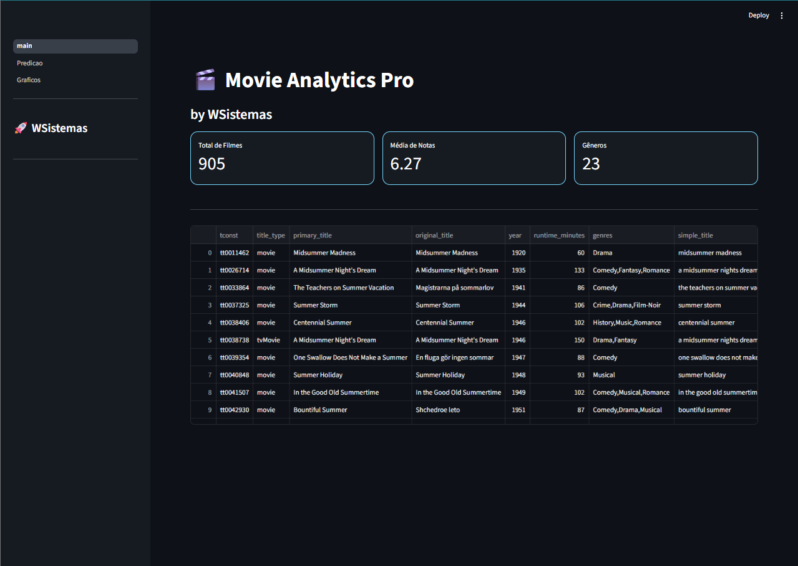
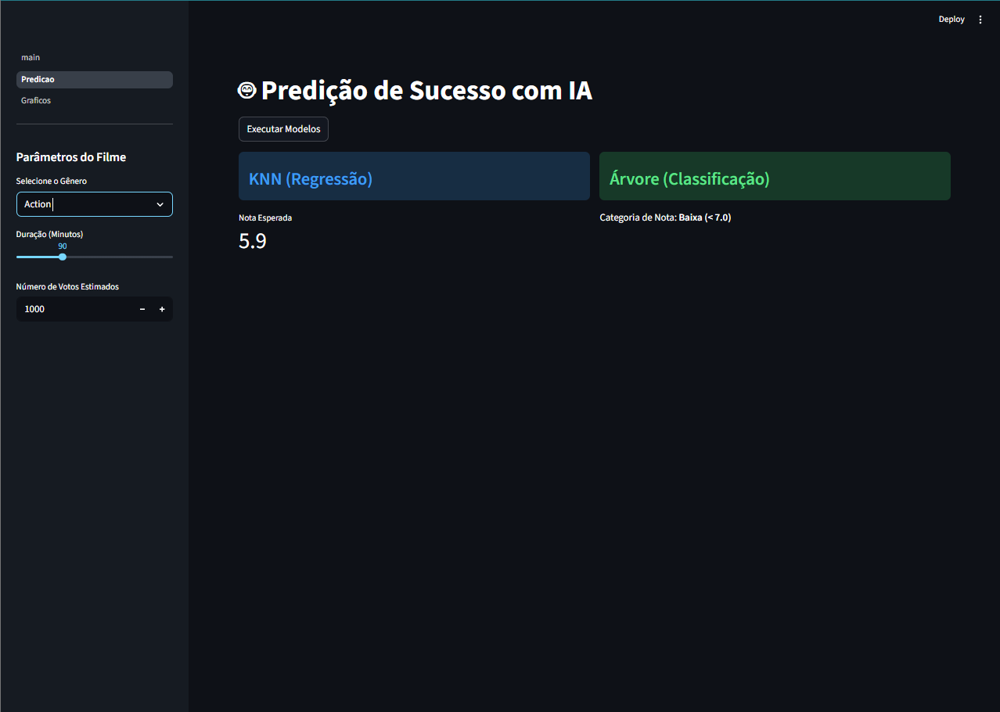
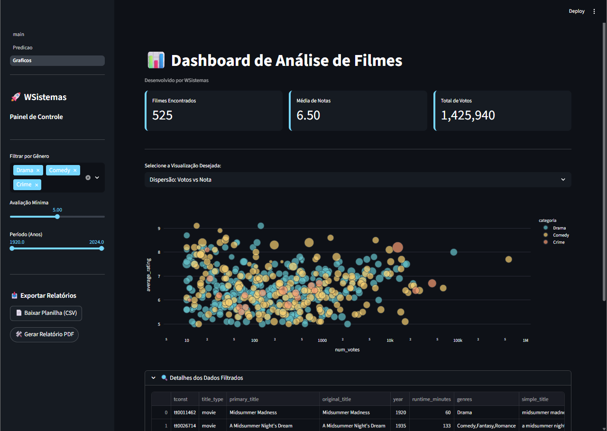

# 
🎬 Movie Analytics Pro — WSistemas

Este repositório documenta a evolução técnica de um projeto de análise de dados e Inteligência Artificial, originalmente concebido em um ambiente acadêmico e agora modernizado para padrões profissionais de Data Science.

📜 A Origem do Projeto
Em 2024, durante um trabalho acadêmico, aceitei o desafio de construir um sistema de Machine Learning utilizando PHP. O objetivo era processar um dataset de filmes para realizar predições através de algoritmos de KNN e Árvore de Decisão, além de gerar visualizações estatísticas.

Na época, embora o PHP apresentasse limitações severas para o cálculo computacional intensivo e manipulação de matrizes, a implementação serviu como uma prova de conceito fundamental para entender a lógica por trás dos algoritmos.

🚀 A Modernização: Python & Pandas
Hoje, o projeto foi totalmente remodelado. Substituímos a estrutura legada por um ecossistema robusto em Python, otimizando a performance e a precisão das análises. A transição permitiu tratar dados de forma analítica, lidando com inconsistências e valores nulos de maneira estatística, algo que no sistema anterior era processado de forma manual e limitada.

📊 Matriz de Evolução Tecnológica
<table width="100%">
<thead>
<tr style="background-color: #161b22;">
<th align="left">Recurso</th>
<th align="left">Implementação PHP (Legada)</th>
<th align="left">Implementação Python (Atual)</th>
</tr>
</thead>
<tbody>
<tr>
<td><b>Processamento</b></td>
<td>Loops procedurais <code>while</code> e <code>fgetcsv</code></td>
<td>Operações vetoriais com <b>Pandas</b></td>
</tr>
<tr>
<td><b>Cálculo KNN</b></td>
<td>Função manual de distância euclidiana</td>
<td>Algoritmo otimizado via <b>Scikit-Learn</b></td>
</tr>
<tr>
<td><b>Gráficos</b></td>
<td>Imagens estáticas via <b>PHPlot</b></td>
<td>Dashboards interativos via <b>Plotly</b></td>
</tr>
<tr>
<td><b>Interface</b></td>
<td>HTML/CSS misturado ao código lógico</td>
<td>Interface reativa com <b>Streamlit</b></td>
</tr>
</tbody>
</table>

🛠️ Tecnologias e Bibliotecas Utilizadas
Pandas: Utilizado para a manipulação e limpeza do dataset summer_movies.csv, garantindo a tipagem correta de dados e tratamento de valores ausentes.

Scikit-Learn: Biblioteca responsável pelo motor de IA. Implementamos o KNeighborsRegressor para predição de notas e o DecisionTreeClassifier para classificação de sucesso.

Streamlit: Framework utilizado para criar a interface web de alta performance, permitindo a interação em tempo real com os modelos.

Plotly: Responsável pela geração de gráficos dinâmicos e multidimensionais (Dispersão, Tendência Temporal e Distribuição).

Joblib: Utilizado para a persistência dos modelos treinados, permitindo que a aplicação realize predições instantâneas sem re-treinamento.

FPDF2: Implementação de motor para exportação de relatórios técnicos em PDF.

🏗️ Estrutura Analítica do Sistema
O projeto foi dividido em camadas para facilitar a manutenção:

Data Layer: Armazenamento e integridade do arquivo CSV.

Processing Layer: Scripts Python que transformam variáveis categóricas (gêneros) em dados numéricos através de Label Encoding.

Model Layer: Modelos treinados e salvos em formato .pkl.

Presentation Layer: O Dashboard da WSistemas, onde o usuário final consome as análises e realiza simulações.

📉 Resultados Obtidos
A transição para Python permitiu um ganho direto na precisão dos modelos. Ao incluir a variável "Categoria" (Gênero) no treinamento, 
o modelo KNN apresentou uma evolução significativa na métrica de erro, enquanto a Árvore de Decisão atingiu uma acurácia superior a 75% na classificação de filmes bem avaliados.

🖼️ Visualização do Sistema Funcional

<table width="100%">
<tr>
<td align="center" width="33%">
<b>Dashboard Principal</b>

</td>
<td align="center" width="33%">
<b>Predição com IA</b>

</td>
<td align="center" width="33%">
<b>Análise Gráfica</b>

</td>
</tr>
</table>

<h3 style="color: #77d7ff; margin-top: 0;">📂 Estrutura de Diretórios: Movie Analytics Pro</h3>
<ol>
<li style="margin-bottom: 10px;">
<code style="color: #ff7b72; font-weight: bold;">projeto_movies_v2/</code> — Raiz do ecossistema modernizado.
<ul>
<li>
<code style="color: #79c0ff;">data/</code> — <b>Camada de Persistência</b>
<ul>
<li><code>summer_movies.csv</code> — Base de dados original de filmes.</li>
</ul>
</li>
<li>
<code style="color: #79c0ff;">models/</code> — <b>Engine de Machine Learning</b>
<ul>
<li><code>knn_regressor.py</code> — Implementação evolutiva do algoritmo KNN.</li>
<li><code>decision_tree.py</code> — Implementação da Árvore de Decisão para classificação.</li>
</ul>
</li>
<li>
<code style="color: #79c0ff;">app/</code> — <b>Frontend Reativo (Streamlit)</b>
<ul>
<li><code>main.py</code> — Ponto de entrada e dashboard principal da aplicação.</li>
<li><code>pages/</code> — Módulos individuais de visualização e predição por IA.</li>
</ul>
</li>
<li>
<code style="color: #79c0ff;">utils/</code> — <b>Processamento de Backend</b>
<ul>
<li><code>data_processor.py</code> — Scripts de ETL, limpeza e tratamento estatístico.</li>
</ul>
</li>
<li>
<code style="color: #d2a8ff;">requirements.txt</code> — Manifesto de dependências e bibliotecas do ecossistema.
</li>
<li>
<code style="color: #d2a8ff;">README.md</code> — Documentação analítica e técnica do projeto.
</li>
</ul>
</li>
</ol>

<b>Desenvolvido por WSistemas</b>

<i>(Wesley Samuel Ferreira Rodrigues)</i>

